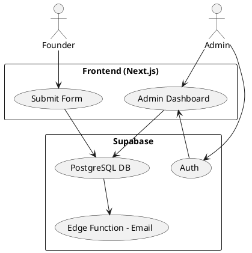

# SPEC-1-Startup Pitch Studio Platform

## Background

Startup Pitch Studio requires a web-based platform where founders can submit structured startup information through a comprehensive questionnaire. The submitted data must be stored securely in Supabase (PostgreSQL backend).

The platform will include:

- A public founder-facing submission form (no login required)
- A secure admin panel with a single shared login for investors
- A dashboard where investors can:
  - View all submitted startups in a list format
  - Review detailed startup information
  - Mark startups as "Selected"
  - View selected startups on a separate filtered page

The goal of the system is to streamline startup application intake and investor shortlisting through a simple, scalable, and structured digital workflow.


## Requirements

### Must Have (M)

- Public founder submission form with all 10 questionnaire sections
- Form validation (required fields, email format, numeric validations)
- Store all submissions in Supabase (PostgreSQL)
- Admin login (single shared credential)
- Admin dashboard listing all submissions (paginated table)
- Detailed view page for each startup submission
- Ability to mark a startup as "Selected"
- Separate page showing only "Selected" startups
- Basic authentication protection for admin routes
- Timestamp tracking (created_at)
- Basic analytics dashboard (total applications, selected ratio)
- Email notification to admin when new submission arrives

### Should Have (S)

- Search and filter functionality (by city, stage, revenue, etc.)
- Sort by date, revenue, stage
- Export selected startups as CSV
- Status tags (Pending / Selected)

### Could Have (C)

- Email notification to admin when new submission arrives
- Basic analytics dashboard (total applications, selected ratio)

### Won’t Have for MVP (W)

- Founder login & profile management
- Multi-role admin access
- Payment integration
- Automated pitch deck generation


## Method

### 1. High-Level Architecture

- Frontend: Next.js (App Router) deployed on Vercel
- Backend: Supabase (PostgreSQL + Auth + Edge Functions)
- Email Service: Supabase Edge Function + Resend (SMTP)

System Flow:

1. Founder submits form → Data sent to Supabase via REST client
2. Record inserted into `startups` table
3. DB trigger invokes Edge Function
4. Edge Function sends email notification to admin
5. Admin logs in → Views dashboard → Updates status

### Architecture Diagram (PlantUML)



---

### 2. Database Schema (Supabase PostgreSQL)

#### Table: startups

```sql
create table startups (
  id uuid primary key default gen_random_uuid(),

  -- Basic Info
  startup_name text not null,
  founder_names text not null,
  designation text,
  contact_number text,
  email text not null,
  city text,
  country text,
  website text,
  instagram text,
  linkedin text,
  facebook text,
  youtube text,
  year_of_incorporation int,
  legal_structure text,

  -- Founder Profile
  education text,
  total_experience_years int,
  industry_experience text,
  previous_startup_experience text,
  why_right_person text,

  -- Startup Concept
  five_word_description text,
  elevator_pitch text,
  problem_statement text,
  target_customer text,
  differentiation text,
  market_size text,
  current_stage text,

  -- Financials
  products_services text,
  pricing text,
  average_order_value numeric,
  monthly_sales_volume int,
  gross_margin numeric,
  net_profit_margin numeric,
  cost_of_production numeric,
  marketing_cac numeric,
  delivery_cost numeric,
  contribution_margin numeric,

  -- Traction
  is_generating_revenue boolean,
  revenue_year1 numeric,
  revenue_year2 numeric,
  revenue_year3 numeric,
  current_monthly_revenue numeric,
  monthly_growth_rate numeric,
  retention_rate numeric,
  active_customers int,
  partnerships text,

  -- Business Model
  revenue_model text,
  acquisition_channels text,
  cac numeric,
  ltv numeric,
  ltv_cac_ratio numeric,

  -- Fundraising
  raised_before boolean,
  previous_funding text,
  investment_seeking numeric,
  equity_offered numeric,
  pre_money_valuation numeric,
  post_money_valuation numeric,
  fund_utilization text,
  runway_months int,

  -- Team
  core_team text,
  planned_hires text,
  advisory_board text,

  -- Vision
  revenue_projection_3y text,
  vision_5y text,
  exit_strategy text,

  -- Pitch Readiness
  pitch_deck_link text,
  financial_projection_link text,
  prepared_for_qa boolean,
  why_shortlist text,

  -- Admin
  status text default 'Pending',
  created_at timestamp default now()
);
```

Index for performance:

```sql
create index idx_startups_status on startups(status);
create index idx_startups_created_at on startups(created_at desc);
```

---

### 3. Admin Authentication

Since single shared login is required:

Option (Recommended MVP):
- Use Supabase Auth
- Create one admin user manually
- Protect `/admin/*` routes using session check

Middleware logic:

- If not authenticated → redirect to /admin/login
- If authenticated → allow access

---

### 4. Status Selection Logic

When admin clicks "Select":

```sql
update startups
set status = 'Selected'
where id = <startup_id>;
```

Selected Page Query:

```sql
select * from startups
where status = 'Selected'
order by created_at desc;
```

---

### 5. Analytics Dashboard Queries

Total Applications:

```sql
select count(*) from startups;
```

Total Selected:

```sql
select count(*) from startups where status = 'Selected';
```

Selection Ratio:

```sql
select 
  (count(*) filter (where status='Selected')::float 
  / nullif(count(*),0)) * 100 as selection_ratio
from startups;
```

---

### 6. Email Notification Flow

1. Create DB trigger:

```sql
create or replace function notify_admin()
returns trigger as $$
begin
  perform net.http_post(
    url := 'https://<project>.functions.supabase.co/send-email',
    headers := jsonb_build_object('Content-Type', 'application/json'),
    body := jsonb_build_object('startup_name', NEW.startup_name)
  );
  return NEW;
end;
$$ language plpgsql;
```

2. Trigger:

```sql
create trigger on_startup_insert
after insert on startups
for each row execute function notify_admin();
```

3. Edge Function sends email using Resend API to admin email.

---

This architecture ensures:

- Clean separation of concerns
- Scalable DB structure
- Minimal operational overhead
- Secure admin access
- Automatic investor notification